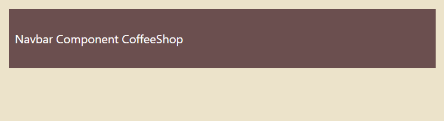
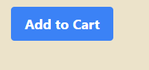
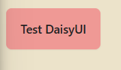
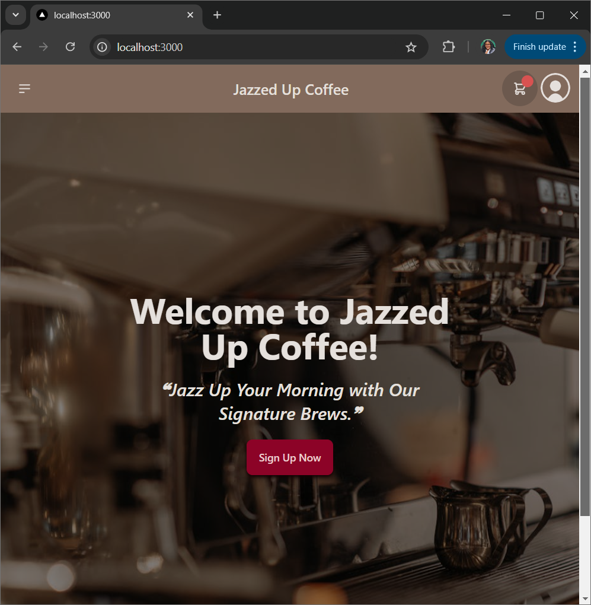
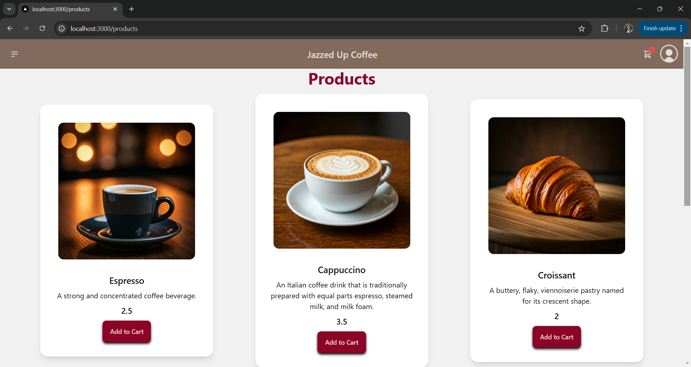
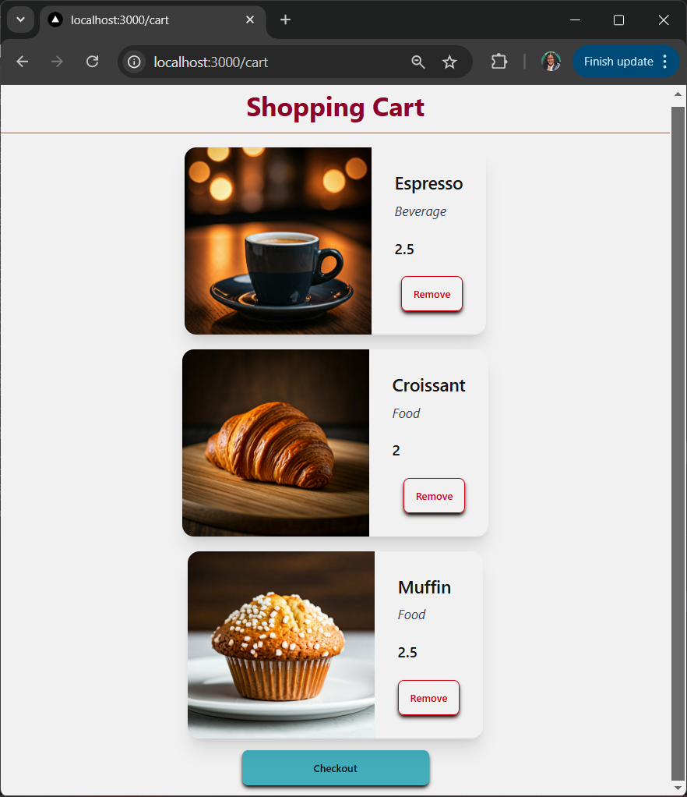
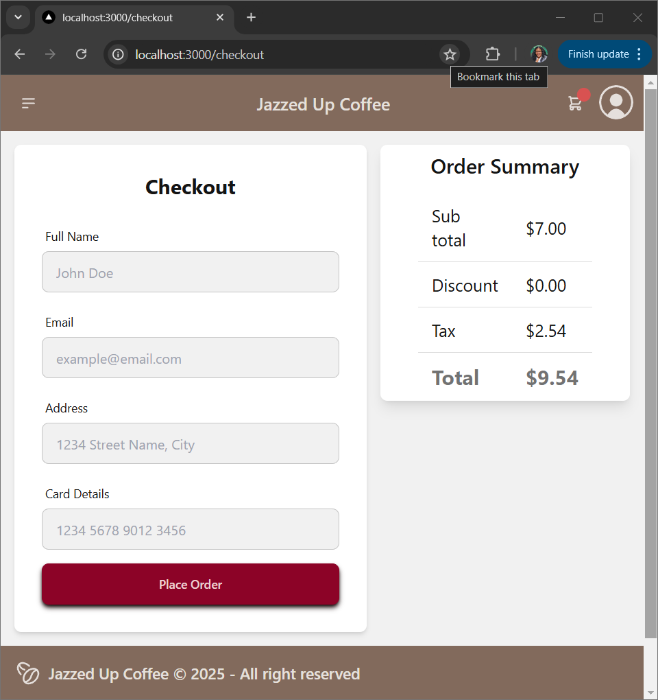
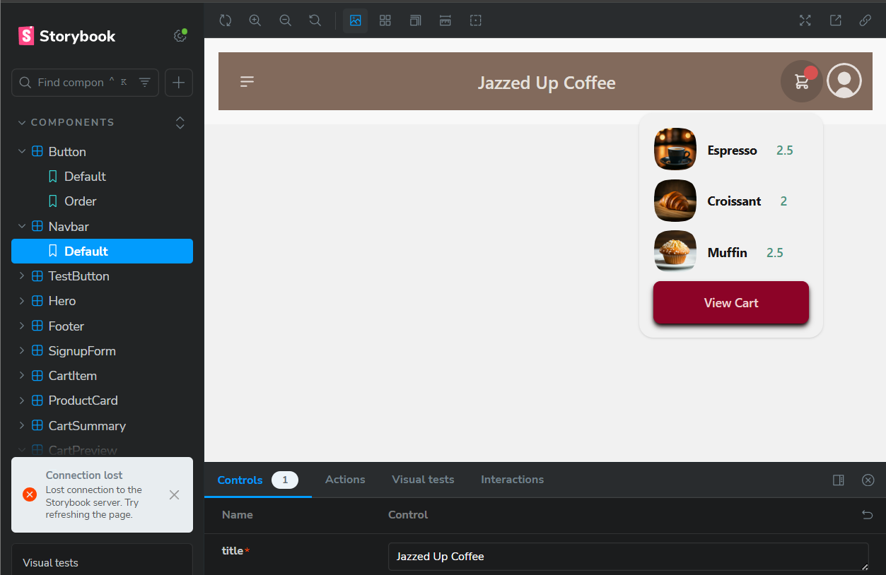

# Coffee Shop Frontend

This is a project to build a frontend for a coffee shop. The project will include a variety of components and features to create a user-friendly experience for customers.

Live link: https://coffee-shop-frontend-seven.vercel.app/

## Technologies

- React
- Next.js
- Tailwind CSS
- Storybook
- DaisyUI
- Vercel
- ...

## Components

- [ ] Navbar
- [ ] Footer
- [ ] Button
- [ ] Loader
- [ ] Toast
- [ ] ProductCard
- [ ] CartItem
- [ ] CartSummary

## Features

- [ ] Tailwind CSS with DaisyUI integration.
- [ ] Storybook for component development.
- [ ] Component stubs for all components.

## Setup

If you would like to try this project out or contribute, follow these steps:

1. Clone the repository.
2. Run `npm install` to install dependencies.
3. Start the app with `npm run dev`.
4. Open Storybook with `npm run storybook`.

## Contributing

If you would like to contribute to this project, please follow these steps:

1. Fork the repository.
2. Create a new branch for your feature.
3. Make your changes.
4. Test your changes.
5. Push your changes to your fork.
6. Create a pull request.

## Screenshots

### Navbar (Storybook, DaisyUi, Custom CSS)



### Button (Storybook, Tailwind)



### Test Button (Storybook, DaisyUi)



## Attribution

Resources or inspiration used in this project.

- [Tailwind CSS](https://tailwindcss.com/)
- [DaisyUI](https://daisyui.com/)
- [Storybook](https://storybook.js.org/)

### Images

Images Resource: pexels.com

- Hero Photo by Pavel Danilyuk
- Signup Photo by 鄭年堯

# Day 2: Coffee Shop Frontend

## Objective

Continue building the Coffee Shop project started on Day 1 by creating and structuring the frontend pages, breaking them into reusable components, and enhancing the design for consistency. Verify components using Storybook to ensure proper functionality and styling.

---

## Tasks

### 1. Create Basic Pages

Set up the following pages in the `pages` directory to establish the structure of the application:

#### Required Pages:

- `index.jsx` (Home Page)
- `products/index.jsx` (Product List Page)
- `products/[id].jsx` (Individual Product Page)
- `cart.jsx` (Shopping Cart Page)
- `checkout.jsx` (Checkout Page)
- `signup.jsx` (Signup Page)
- `signin.jsx` (Login Page)

#### Optional Admin Pages:

- `admin/list-products.jsx`
- `admin/create-product.jsx`
- `admin/view-product.jsx`
- `admin/update-product.jsx` (includes delete confirmation popup)

---

### 2. Splash Page (Home Page)

#### Step 1: Create the Layout

In `index.jsx`, implement a splash page with:

- Navbar
- Hero Image with Call-to-Action (CTA) Button
- Brief Description
- Footer

#### Step 2: Break Page Into Components

Split the layout into reusable components:

- `Navbar`
- `Footer`
- `HeroSection`

#### Step 3: Verify Components in Storybook

- Create stories for each component and verify functionality.

---

### 3. Signup Page

#### Step 1: Layout

- Include `Navbar` and `Footer` components.
- Add a signup form with:
  - Name
  - Email
  - Password
  - Submit Button

#### Step 2: Create `SignupForm` Component

Break the form into a reusable component:

**`src/components/SignupForm.jsx`:**

```jsx
import PropTypes from "prop-types";
import Button from "@/components/Button";

export default function SignupForm({ buttonLabel, handleSignup }) {
  return (
    <form className="form flex flex-col gap-4">
      <label className="input input-bordered flex items-center gap-2">
        <svg
          xmlns="http://www.w3.org/2000/svg"
          viewBox="0 0 16 16"
          fill="currentColor"
          className="h-4 w-4 opacity-70"
        >
          <path d="M8 8a3 3 0 1 0 0-6 3 3 0 0 0 0 6ZM12.735 14c.618 0 1.093-.561.872-1.139a6.002 6.002 0 0 0-11.215 0c-.22.578.254 1.139.872 1.139h9.47Z" />
        </svg>
        <input type="text" className="grow" placeholder="Name" />
      </label>
      <label className="input input-bordered flex items-center gap-2">
        <svg
          xmlns="http://www.w3.org/2000/svg"
          viewBox="0 0 16 16"
          fill="currentColor"
          className="h-4 w-4 opacity-70"
        >
          <path d="M2.5 3A1.5 1.5 0 0 0 1 4.5v.793c.026.009.051.02.076.032L7.674 8.51c.206.1.446.1.652 0l6.598-3.185A.755.755 0 0 1 15 5.293V4.5A1.5 1.5 0 0 0 13.5 3h-11Z" />
          <path d="M15 6.954 8.978 9.86a2.25 2.25 0 0 1-1.956 0L1 6.954V11.5A1.5 1.5 0 0 0 2.5 13h11a1.5 1.5 0 0 0 1.5-1.5V6.954Z" />
        </svg>
        <input type="text" className="grow" placeholder="Email" />
      </label>
      <label className="input input-bordered flex items-center gap-2">
        <svg
          xmlns="http://www.w3.org/2000/svg"
          viewBox="0 0 16 16"
          fill="currentColor"
          className="h-4 w-4 opacity-70"
        >
          <path
            fillRule="evenodd"
            d="M14 6a4 4 0 0 1-4.899 3.899l-1.955 1.955a.5.5 0 0 1-.353.146H5v1.5a.5.5 0 0 1-.5.5h-2a.5.5 0 0 1-.5-.5v-2.293a.5.5 0 0 1 .146-.353l3.955-3.955A4 4 0 1 1 14 6Zm-4-2a.75.75 0 0 0 0 1.5.5.5 0 0 1 .5.5.75.75 0 0 0 1.5 0 2 2 0 0 0-2-2Z"
            clipRule="evenodd"
          />
        </svg>
        <input type="password" className="grow" placeholder="Password" />
      </label>
      <Button label={buttonLabel} handleClick={handleSignup} />
    </form>
  );
}

SignupForm.propTypes = {
  buttonLabel: PropTypes.string.isRequired,
  handleSignup: PropTypes.func.isRequired,
};
```

#### Step 3: Verify in Storybook

Create a story for the `SignupForm` component and validate its functionality with mock props.

---

### 4. Product Page

#### Step 1: Layout

In `products/[id].jsx`, build a layout for individual product pages:

- Navbar and Footer
- Product details:
  - Image
  - Name
  - Description
  - Price
  - "Add to Cart" Button

#### Step 2: Create `ProductCard` Component

**Example ProductCard:**

```jsx
import PropTypes from "prop-types";
import Button from "./Button";

export default function ProductCard({ product, handleClick }) {
  return (
    <div className="card bg-white w-96 shadow-lg">
      <figure className="px-10 pt-10">
        
      </figure>
      <div className="card-body items-center text-center">
        <h2 className="card-title">{product.name}</h2>
        <p>{product.description}</p>
        <p className="text-lg font-semibold">{product.price}</p>
        <div className="card-actions">
          <Button label={"Add to Cart"} handleClick={handleClick} />
        </div>
      </div>
    </div>
  );
}

ProductCard.propTypes = {
  product: PropTypes.object.isRequired,
};
```

#### Step 3: Verify in Storybook

Create a story for `ProductCard` using mock product data.

---

## Design Process

I like to work on what I call my global components first (Navbar, Footer, Button). Then, I focus on designing one page at a time, ensuring every detail—such as the site name, CTA button labels, slogans, messages, and color schemes—is considered. This approach helps me stay organized and prevents forgetting small but important details, which might happen if I were to hop between different parts of the project. By focusing on one page at a time, I find that I can complete the project more efficiently.

---

## Screenshot Section

### Home Page



### Product List Page



### Product Page

![Product [id] page](image-5.png)

### Cart Page



### Checkout Page



### Cart Preview

Added a cart preview component to the navbar.



---

## Stretch Goals

- Add animations for page transitions using a library like Framer Motion.
- Include a "Recently Viewed Products" section on the home or product pages.
- Implement a dark mode toggle for the entire application.
- Enable search functionality with filtering options for products.
- Integrate a ratings and reviews feature for individual product pages.
- Work on admin pages.
- Improve designs for the cart page.

---

## Summary

Day 2 focused on:

- Setting up foundational pages.
- Breaking layouts into reusable components.
- Verifying components in Storybook.
- Preparing for further enhancements in functionality and design.
