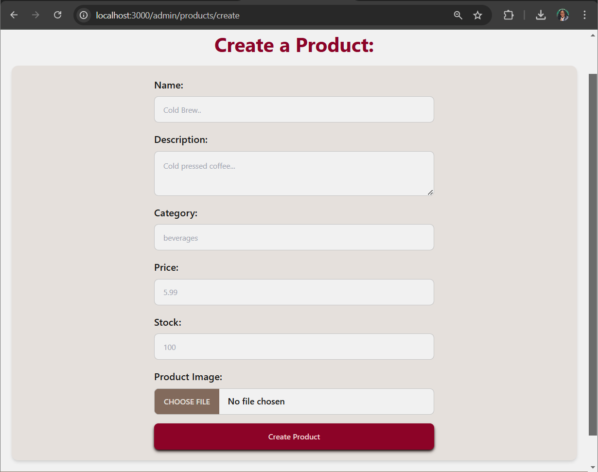

# Coffee Shop Frontend

This is a project to build a frontend for a coffee shop. The project will include a variety of components and features to create a user-friendly experience for customers.

Live link: https://coffee-shop-frontend-seven.vercel.app/

## Technologies

- React
- Next.js
- Tailwind CSS
- Storybook
- DaisyUI
- Vercel
- ...

## Components

- [ ] Navbar
- [ ] Footer
- [ ] Button
- [ ] Loader
- [ ] Toast
- [ ] ProductCard
- [ ] CartItem
- [ ] CartSummary

## Features

- [ ] Tailwind CSS with DaisyUI integration.
- [ ] Storybook for component development.
- [ ] Component stubs for all components.

## Setup

If you would like to try this project out or contribute, follow these steps:

1. Clone the repository.
2. Run `npm install` to install dependencies.
3. Start the app with `npm run dev`.
4. Open Storybook with `npm run storybook`.

## Contributing

If you would like to contribute to this project, please follow these steps:

1. Fork the repository.
2. Create a new branch for your feature.
3. Make your changes.
4. Test your changes.
5. Push your changes to your fork.
6. Create a pull request.

## Screenshots

### Navbar (Storybook, DaisyUi, Custom CSS)


### Button (Storybook, Tailwind)


### Test Button (Storybook, DaisyUi)


## Attribution

Resources or inspiration used in this project.

- [Tailwind CSS](https://tailwindcss.com/)
- [DaisyUI](https://daisyui.com/)
- [Storybook](https://storybook.js.org/)

### Images

Images Resource: pexels.com

- Hero Photo by Pavel Danilyuk
- Signup Photo by 鄭年堯

# Day 2: Coffee Shop Frontend

## Objective

Continue building the Coffee Shop project started on Day 1 by creating and structuring the frontend pages, breaking them into reusable components, and enhancing the design for consistency. Verify components using Storybook to ensure proper functionality and styling.

---

## Tasks

### 1. Create Basic Pages

Set up the following pages in the `pages` directory to establish the structure of the application:

#### Required Pages:

- `index.jsx` (Home Page)
- `products/index.jsx` (Product List Page)
- `products/[id].jsx` (Individual Product Page)
- `cart.jsx` (Shopping Cart Page)
- `checkout.jsx` (Checkout Page)
- `signup.jsx` (Signup Page)
- `signin.jsx` (Login Page)

#### Optional Admin Pages:

- `admin/list-products.jsx`
- `admin/create-product.jsx`
- `admin/view-product.jsx`
- `admin/update-product.jsx` (includes delete confirmation popup)

---

### 2. Splash Page (Home Page)

#### Step 1: Create the Layout

In `index.jsx`, implement a splash page with:

- Navbar
- Hero Image with Call-to-Action (CTA) Button
- Brief Description
- Footer

#### Step 2: Break Page Into Components

Split the layout into reusable components:

- `Navbar`
- `Footer`
- `HeroSection`

#### Step 3: Verify Components in Storybook

- Create stories for each component and verify functionality.

---

### 3. Signup Page

#### Step 1: Layout

- Include `Navbar` and `Footer` components.
- Add a signup form with:
  - Name
  - Email
  - Password
  - Submit Button

#### Step 2: Create `SignupForm` Component

Break the form into a reusable component:

**`src/components/SignupForm.jsx`:**

```jsx
import PropTypes from "prop-types";
import Button from "@/components/Button";

export default function SignupForm({ buttonLabel, handleSignup }) {
  return (
    <form className="form flex flex-col gap-4">
      <label className="input input-bordered flex items-center gap-2">
        <svg
          xmlns="http://www.w3.org/2000/svg"
          viewBox="0 0 16 16"
          fill="currentColor"
          className="h-4 w-4 opacity-70"
        >
          <path d="M8 8a3 3 0 1 0 0-6 3 3 0 0 0 0 6ZM12.735 14c.618 0 1.093-.561.872-1.139a6.002 6.002 0 0 0-11.215 0c-.22.578.254 1.139.872 1.139h9.47Z" />
        </svg>
        <input type="text" className="grow" placeholder="Name" />
      </label>
      <label className="input input-bordered flex items-center gap-2">
        <svg
          xmlns="http://www.w3.org/2000/svg"
          viewBox="0 0 16 16"
          fill="currentColor"
          className="h-4 w-4 opacity-70"
        >
          <path d="M2.5 3A1.5 1.5 0 0 0 1 4.5v.793c.026.009.051.02.076.032L7.674 8.51c.206.1.446.1.652 0l6.598-3.185A.755.755 0 0 1 15 5.293V4.5A1.5 1.5 0 0 0 13.5 3h-11Z" />
          <path d="M15 6.954 8.978 9.86a2.25 2.25 0 0 1-1.956 0L1 6.954V11.5A1.5 1.5 0 0 0 2.5 13h11a1.5 1.5 0 0 0 1.5-1.5V6.954Z" />
        </svg>
        <input type="text" className="grow" placeholder="Email" />
      </label>
      <label className="input input-bordered flex items-center gap-2">
        <svg
          xmlns="http://www.w3.org/2000/svg"
          viewBox="0 0 16 16"
          fill="currentColor"
          className="h-4 w-4 opacity-70"
        >
          <path
            fillRule="evenodd"
            d="M14 6a4 4 0 0 1-4.899 3.899l-1.955 1.955a.5.5 0 0 1-.353.146H5v1.5a.5.5 0 0 1-.5.5h-2a.5.5 0 0 1-.5-.5v-2.293a.5.5 0 0 1 .146-.353l3.955-3.955A4 4 0 1 1 14 6Zm-4-2a.75.75 0 0 0 0 1.5.5.5 0 0 1 .5.5.75.75 0 0 0 1.5 0 2 2 0 0 0-2-2Z"
            clipRule="evenodd"
          />
        </svg>
        <input type="password" className="grow" placeholder="Password" />
      </label>
      <Button label={buttonLabel} handleClick={handleSignup} />
    </form>
  );
}

SignupForm.propTypes = {
  buttonLabel: PropTypes.string.isRequired,
  handleSignup: PropTypes.func.isRequired,
};
```

#### Step 3: Verify in Storybook

Create a story for the `SignupForm` component and validate its functionality with mock props.

---

### 4. Product Page

#### Step 1: Layout

In `products/[id].jsx`, build a layout for individual product pages:

- Navbar and Footer
- Product details:
  - Image
  - Name
  - Description
  - Price
  - "Add to Cart" Button

#### Step 2: Create `ProductCard` Component

**Example ProductCard:**

```jsx
import PropTypes from "prop-types";
import Button from "./Button";

export default function ProductCard({ product, handleClick }) {
  return (
    <div className="card bg-white w-96 shadow-lg">
      <figure className="px-10 pt-10">
        
      </figure>
      <div className="card-body items-center text-center">
        <h2 className="card-title">{product.name}</h2>
        <p>{product.description}</p>
        <p className="text-lg font-semibold">{product.price}</p>
        <div className="card-actions">
          <Button label={"Add to Cart"} handleClick={handleClick} />
        </div>
      </div>
    </div>
  );
}

ProductCard.propTypes = {
  product: PropTypes.object.isRequired,
};
```

#### Step 3: Verify in Storybook

Create a story for `ProductCard` using mock product data.

---

## Design Process

I like to work on what I call my global components first (Navbar, Footer, Button). Then, I focus on designing one page at a time, ensuring every detail—such as the site name, CTA button labels, slogans, messages, and color schemes—is considered. This approach helps me stay organized and prevents forgetting small but important details, which might happen if I were to hop between different parts of the project. By focusing on one page at a time, I find that I can complete the project more efficiently.

---

## Screenshot Section

### Home Page


### Product List Page


### Product Page

![Product [id] page](/public/screenshots/image-5.png)

### Cart Page


### Checkout Page


### SignUp Page


### SignIn Page


### Cart Preview

Added a cart preview component to the navbar.


---

## Stretch Goals

- Add animations for page transitions using a library like Framer Motion.
- Include a "Recently Viewed Products" section on the home or product pages.
- Implement a dark mode toggle for the entire application.
- Enable search functionality with filtering options for products.
- Integrate a ratings and reviews feature for individual product pages.
- Work on admin pages.
- Improve designs for the cart page.

---

## Summary

Day 2 focused on:

- Setting up foundational pages.
- Breaking layouts into reusable components.
- Verifying components in Storybook.
- Preparing for further enhancements in functionality and design.

# Day 3 & 4 - Coffee Frontend Project

## Overview

On Days 3 and 4 of the Coffee Frontend Project, I focused on connecting the frontend to the backend by setting up environment variables, handling errors, and implementing form validation. Additionally, I introduced utility functions to manage local storage for user data, products, and the cart.

## Tasks Completed

### 1. Setting Up Environment Variables

To facilitate communication between the frontend and backend, I configured environment variables:

**Created `.env.local` file:**

```plaintext
NEXT_PUBLIC_BACKEND_URL=http://localhost:3000
NEXT_PUBLIC_BACKEND_URL_PROD=https://api.onrender.com
```

These variables help in switching between development and production environments seamlessly.

### 2. Implemented Error Handling and Validation in Forms

#### Signup Form Enhancements:

- Added validation for email format and password length.
- Used `PropTypes` to enforce correct prop types.
- Displayed error messages dynamically.

**Example Code for Validation:**

```javascript
// Check if password is > 8 characters
function checkPassword(password) {
  return password.length > 8;
}

// Validate email format
const checkEmail = (email) => {
  const emailPattern = /^[a-zA-Z0-9._-]+@[a-zA-Z0-9.-]+\.[a-zA-Z]{2,4}$/;
  return emailPattern.test(email);
};
```

#### Signup Form Component:

```javascript
export default function SignupForm({ buttonLabel, handleSignup }) {
  const [passwordValue, setPasswordValue] = useState("");
  const [passwordIsValid, setPasswordIsValid] = useState(false);
  const [nameValue, setNameValue] = useState("");
  const [emailValue, setEmailValue] = useState("");
  const [error, setError] = useState("");

  function handleSubmit(e) {
    e.preventDefault();

    if (!checkEmail(emailValue)) {
      setError("Invalid email format.");
      return;
    }

    const user = {
      name: nameValue,
      email: emailValue,
      password: passwordValue,
    };
    handleSignup(user);

    // Reset form
    setPasswordValue("");
    setNameValue("");
    setEmailValue("");
  }

  return (
    <form onSubmit={handleSubmit} className="form flex flex-col gap-4">
      {/* Input Fields for Name, Email, and Password */}
      {/* Error Handling Display */}
      {error && <p className="text-xs text-red-400">{error}</p>}
      <Button label={buttonLabel} />
    </form>
  );
}
```

### 3. Created Utility Functions for Local Storage

To persist data across sessions, I added utility functions in `src/util/index.js` for handling local storage.

#### Utility Functions Implemented:

- **Load Data from Local Storage:**
  ```javascript
  export const loadProductsFromLocalStorage = () => {
    const products = localStorage.getItem("products");
    return products ? JSON.parse(products) : [];
  };
  ```
- **Save Data to Local Storage:**
  ```javascript
  export const saveUserToLocalStorage = (user) => {
    localStorage.setItem("user", JSON.stringify(user));
  };
  ```
- **Remove Item from Cart:**
  ```javascript
  export const removeItemFromCart = (itemId) => {
    const cart = loadCartFromLocalStorage();
    const updatedCart = cart.filter((item) => item._id !== itemId);
    saveCartToLocalStorage(updatedCart);
    return updatedCart;
  };
  ```

### 4. Implemented Cart Functionality

- **Added functionality to load, save, and update cart items in local storage.**
- **Implemented a cart page to display items and allow quantity adjustments.**
- **Used context API to manage global cart state.**

## Summary

- **Connected the frontend to the backend** using `.env.local`.
- **Added form validation and error handling** for better user experience.
- **Implemented utility functions** to manage user, product, and cart data in local storage.
- **Introduced cart management functionality** using local storage and Context API.

This setup ensures a smoother authentication process and a seamless user experience in the Coffee Frontend Project.

# Coffee Shop Frontend - Part 5

## Overview

In this part of the Coffee Shop Frontend project, the focus was on creating and utilizing custom hooks for fetching data and managing authentication in the Sign-In and Sign-Up pages. The key custom hooks implemented include:

- `useFetch` for fetching product data securely with authentication
- `useAuth` for handling user authentication and session management

These hooks were used primarily in the `products/index.js` and `product/[id].js` pages to enhance code reusability and maintainability.

---

## Custom Hooks Implementation

### 1. `useFetch` Hook

This hook is responsible for fetching product data while handling authentication and error states.

#### **Location:** `hooks/api.js`

```javascript
import { useEffect, useState } from "react";
import { useRouter } from "next/router";

export function useFetch(url, initialState = []) {
  const [data, setData] = useState(initialState);
  const [error, setError] = useState(null);
  const [loading, setLoading] = useState(true);
  const router = useRouter();

  const fetchData = async () => {
    setLoading(true);
    setError(null);

    try {
      const token = localStorage.getItem("token");
      if (!token) {
        console.error("No token found, redirecting to login.");
        router.push("/signin");
        return;
      }

      const response = await fetch(url, {
        headers: {
          Authorization: `Bearer ${token}`,
          "Content-Type": "application/json",
        },
      });

      if (!response.ok) {
        if (response.status === 401) {
          console.error("Unauthorized: Token expired.");
          localStorage.removeItem("token");
          router.push("/signin");
        }
        throw new Error(
          `Fetch error ${response.status}: ${response.statusText}`
        );
      }

      const productData = await response.json();
      if (Array.isArray(productData)) {
        setData(productData);
      } else if (Array.isArray(productData.products)) {
        setData(productData.products);
      } else {
        setData([]);
        setError(true);
      }
    } catch (error) {
      console.error("Failed to fetch products: ", error);
      setError(true);
    } finally {
      setLoading(false);
    }
  };

  useEffect(() => {
    fetchData();
  }, [url]);

  return [error, loading, data];
}
```

---

### 2. `useAuth` Hook

This hook manages authentication by storing and retrieving user session data.

#### **Location:** `hooks/auth.js`

```javascript
import { useEffect, useState } from "react";

export default function useAuth() {
  const [user, setUser] = useState();
  const [token, setToken] = useState();
  const [isAuthenticated, setIsAuthenticated] = useState(false);
  const [authError, setAuthError] = useState(false);

  useEffect(() => {
    try {
      const storedToken = localStorage.getItem("token");
      const storedUser = localStorage.getItem("user");
      if (storedToken) {
        setToken(storedToken);
        setIsAuthenticated(true);
      }
      if (storedUser) {
        setUser(JSON.parse(storedUser));
      }
    } catch (error) {
      console.error("Error in useAuth hook: ", error);
      setAuthError(true);
    }
  }, []);

  const clearAuth = () => {
    localStorage.removeItem("token");
    localStorage.removeItem("user");
    setUser(null);
    setToken(null);
    setIsAuthenticated(false);
  };

  return { user, token, isAuthenticated, authError, clearAuth };
}
```

---

## Usage in `products/index.js`

The `useFetch` hook is used to fetch product data and update the UI accordingly.

```javascript
import { useFetch } from "@/hooks/api";
const BACKEND_URL = process.env.NEXT_PUBLIC_BACKEND_URL;

export default function ProductsPage() {
  const [url, setUrl] = useState(`${BACKEND_URL}/products`);
  const [productsFetchError, loading, products] = useFetch(url, []);

  return (
    <div>
      <h1 className="text-4xl font-bold text-center">Products</h1>
      {productsFetchError ? (
        <p className="text-red-400 text-lg text-center">
          Error fetching products. Please try again later.
        </p>
      ) : (
        ""
      )}
      {loading ? (
        <p>Loading...</p>
      ) : (
        <div>
          {products.map((product) => (
            <ProductCard key={product._id} product={product} />
          ))}
        </div>
      )}
    </div>
  );
}
```

---

## Key Takeaways

- **Reusability**: The custom hooks allow reusing API fetching and authentication logic across multiple pages.
- **Authentication Handling**: The `useAuth` hook ensures session management and token validation.
- **Improved State Management**: The hooks simplify data fetching, state management, and error handling.
- **Secure API Requests**: The `useFetch` hook ensures only authenticated users can fetch protected resources.

---

## Next Steps

- Implement more custom hooks for cart management and user profile handling.
- Improve error messaging and retry logic for API requests.

# Coffee Shop Frontend - Part 6

## Overview

In this phase of the Coffee Shop frontend development, I focused on learning and implementing `useContext` to manage authentication state across the application. This was crucial for creating admin pages with restricted access.

## Key Features Implemented

- **Authentication Management:** Implemented `useContext` to handle authentication state.
- **Admin Pages:** Developed pages for editing and creating products with access restricted to authenticated users.
- **Form Handling:** Used `FormData` for product creation, including file uploads.
- **Dynamic Routing:** Implemented Next.js dynamic routes for handling product creation and updates.

## Understanding `useContext`

`useContext` is a React hook that allows state sharing across multiple components without the need for prop drilling. In this project, it was used to manage authentication state globally.

### Authentication Context (`context/AuthContext.js`)

I created `AuthContext.js` to centralize authentication state, making it accessible across multiple components.

```javascript
import { createContext, useContext } from "react";
import useAuthHook from "@/hooks/auth";

const AuthContext = createContext();

export function AuthProvider({ children }) {
  const { user, token, isAuthenticated, clearAuth } = useAuthHook();

  return (
    <AuthContext.Provider value={{ user, token, isAuthenticated, clearAuth }}>
      {children}
    </AuthContext.Provider>
  );
}

export const useAuth = () => useContext(AuthContext);
```

## Admin Pages

### Edit Product Page (`admin/products/[id].js`)

- Fetches product data from the backend using the `id` from the URL.
- Uses authentication to ensure only authorized users can edit products.
- Handles form submission to update the product details.

```javascript
const { token } = useAuth();
useEffect(() => {
  async function fetchProduct() {
    const response = await fetch(`${BACKEND_URL}/products/${id}`, {
      headers: { Authorization: `Bearer ${token}` },
    });
    const product = await response.json();
    setName(product.name);
    setDescription(product.description);
  }
  fetchProduct();
}, [id, token]);
```

### Create Product Page (`admin/products/create.js`)

- Implements a form to add new products.
- Uses `FormData` to handle file uploads.
- Sends an authenticated request to the backend to create the product.

```javascript
async function createProduct(product) {
  const response = await fetch(createUrl, {
    method: "POST",
    body: product,
    headers: { Authorization: `Bearer ${token}` },
  });
}
```

### Delete Product Functionality

- Added a delete button to allow admins to remove products.
- Sends a DELETE request to the backend with authentication headers.

```javascript
async function deleteProduct(productId) {
  const response = await fetch(`${BACKEND_URL}/products/${productId}`, {
    method: "DELETE",
    headers: { Authorization: `Bearer ${token}` },
  });
  if (response.ok) {
    alert("Product deleted successfully");
  } else {
    alert("Failed to delete product");
  }
}
```

## Screenshots

### Index Page (`admin/products/`)


### Create Product Page (`admin/products/create.js`)



### Edit Product Page (`admin/products/[id].js`)


### Index Page After Edit (`admin/products/`)


### Delete Product Action


## Conclusion

This part of the project strengthened my understanding of React Context API and authentication management. It also reinforced my skills in making authenticated requests, handling form data effectively, and managing dynamic routing in Next.js.

# Coffee Shop Frontend - Part 7: Cart & Quantity Feature

## Overview

In this phase of the Coffee Shop Frontend project, I focused on enhancing the cart functionality by adding a quantity button and implementing logic to handle duplicate items in the cart efficiently. The main goal was to ensure that the cart summary reflected accurate prices based on item quantities while addressing conflicts between the cart preview (in the navbar) and the cart page.

## Key Features Implemented

### 1. Quantity Button & Duplicate Handling

- Implemented a `QuantityBtn` component to allow users to adjust item quantities directly within the cart.
- Ensured that adding the same product multiple times updated the quantity instead of creating duplicates.
- Used the `useState` hook to manage item quantities and update the cart dynamically.

### 2. Cart Summary Accuracy

- Modified `CartSummary.jsx` to properly calculate and display:
  - Subtotal
  - Tax (at a rate of 4.45%)
  - Total price
- Ensured that these values updated dynamically based on the cart contents.

### 3. Resolving Cart State Conflicts

- Encountered an issue where `CartPreview` (displayed in the navbar) and the main cart page overwrote each other’s state.
- After extensive testing and debugging with `console.log`, I decided to use `useContext` to manage global cart state, ensuring consistent updates across all cart-related components.

## Files Updated

### `CartItem.jsx`

- Displays cart items with their images, names, categories, prices, and quantity controls.
- Uses the `useEffect` hook to update the quantity dynamically and recalculate the total price.
- Includes a "Remove" button to delete items from the cart.

### `CartPreview.jsx`

- Shows a summary of cart items in the navbar dropdown.
- Displays product images, names, quantities, and total prices.
- Ensures a consistent view of the cart in the navbar without interfering with the main cart page.

### `CartSummary.jsx`

- Loads the cart from local storage to maintain state across page reloads.
- Computes subtotal, tax, and total dynamically.
- Ensures prices update correctly when item quantities change.

### `Navbar.jsx`

- Integrates `CartPreview` to display a quick cart summary in the navbar.
- Uses `useContext` to manage global cart state.
- Implements a dynamic cart indicator showing the total number of items in the cart.

## Challenges & Solutions

### 1. **Duplicate Items in Cart**

- **Issue:** When adding the same product multiple times, it created duplicate entries instead of updating the quantity.
- **Solution:** Modified the cart logic to check for existing items and update the quantity instead of adding a new entry.

### 2. **State Conflicts Between Cart Pages**

- **Issue:** The `CartPreview` (in navbar) and `Cart` page were overwriting each other's state, causing inconsistent UI behavior.
- **Solution:** Implemented `useContext` to centralize cart state management, ensuring both components remained in sync.

## Conclusion

This update significantly improved the shopping experience by streamlining cart management, enhancing price accuracy, and maintaining state consistency across components. By leveraging `useContext`, I resolved conflicting cart state issues, ensuring a seamless cart experience for users. Future improvements may include persisting cart state across sessions and adding a checkout process.

# Coffee Shop Frontend - Part 8: Finalization, Testing, and Cleanup

## Overview

This phase of the Coffee Shop Frontend project focused on finalizing features, testing functionality, and cleaning up the codebase. The primary updates included:

- Creation of static pages (`About` and `Account`)
- Implementation of theme toggling (light/dark mode)
- Ensuring UI consistency across themes
- Adding pagination to product pages for both users and admin
- Implementing state management for alert messages using `useState`
- Styling alerts with DaisyUI

## Features Implemented

### 1. **Static Pages**

- Created an `About` page to provide information about the coffee shop.
- Developed an `Account` page for user profile management.

### 2. **Theme Toggle (Light/Dark Mode)**

Implemented a theme toggle component that allows users to switch between light (`autumn`) and dark (`coffee`) modes. The theme selection is persisted in `localStorage`.

**Code Implementation:**

```javascript
import { useEffect, useState } from "react";
export default function ThemeToggle() {
  const [isDark, setIsDark] = useState(false);

  useEffect(() => {
    const storedTheme = localStorage.getItem("theme") === "coffee";
    setIsDark(storedTheme);
  }, []);

  useEffect(() => {
    const theme = isDark ? "coffee" : "autumn";
    document.documentElement.setAttribute("data-theme", theme);
    localStorage.setItem("theme", theme);
  }, [isDark]);

  return (
    <label className="swap swap-rotate">
      <input
        type="checkbox"
        onChange={() => setIsDark(!isDark)}
        checked={isDark}
        aria-label="Toggle theme"
        className="theme-controller"
      />
      {/* Icons for theme toggle */}
      <svg
        className="swap-off h-10 w-10 fill-current"
        xmlns="http://www.w3.org/2000/svg"
        viewBox="0 0 24 24"
      >
        <path d="..." />
      </svg>
      <svg
        className="swap-on h-10 w-10 fill-current"
        xmlns="http://www.w3.org/2000/svg"
        viewBox="0 0 24 24"
      >
        <path d="..." />
      </svg>
    </label>
  );
}
```

### 3. **Pagination for Products Pages**

Pagination was added for both user and admin product pages to enhance performance and usability.

- Uses `useFetch` hook to retrieve paginated data.
- Supports customizable page limits.

**Code Implementation:**

```javascript
import { useEffect, useState } from "react";
import { useRouter } from "next/router";

export function useFetch(url, initialState = [], page = 1, limit = 5) {
  const [data, setData] = useState(initialState);
  const [totalPages, setTotalPages] = useState(1);
  const [error, setError] = useState(null);
  const [loading, setLoading] = useState(true);
  const router = useRouter();

  useEffect(() => {
    const fetchData = async () => {
      setLoading(true);
      setError(null);

      try {
        const token = localStorage.getItem("token");
        if (!token) {
          router.push("/signin");
          return;
        }

        const response = await fetch(`${url}?page=${page}&limit=${limit}`, {
          headers: {
            Authorization: `Bearer ${token}`,
            "Content-Type": "application/json",
          },
        });

        if (!response.ok) {
          if (response.status === 401) {
            localStorage.removeItem("token");
            router.push("/signin");
          }
          throw new Error(
            `Fetch error ${response.status}: ${response.statusText}`
          );
        }

        const result = await response.json();
        setData(result.products || result);
        setTotalPages(result.totalPages || 1);
      } catch (err) {
        setError(err.message);
      } finally {
        setLoading(false);
      }
    };
    fetchData();
  }, [url, page, limit, router]);

  return { data, totalPages, error, loading };
}
```

### 4. **State-Based Alert Messages**

- Used `useState` to manage alert messages for user interactions.
- Styled alerts with DaisyUI to match the theme and UI design.

## Testing & Debugging

- Tested all major features, including theme toggling, pagination, and authentication redirects.
- Ensured consistency in UI appearance across different themes.
- Verified API calls for fetching paginated products and token authentication handling.

## Final Cleanup

- Removed redundant code and optimized state handling.
- Ensured better error handling and user feedback for failed API requests.
- Conducted UI refinements for a polished look.

---

# ☕ **Coffee Shop - Project Wrap-Up**

📌 **Project Overview**  
The Coffee Shop frontend project is a functional web application designed to provide a seamless coffee shopping experience. Users can browse coffee products, manage their accounts, and toggle between dark and light themes. The backend handles authentication, product management, and pagination. This project has been an exciting journey, and this wrap-up showcases the progress, technologies used, and future goals.

🚀 **Progress Highlights**  
✅ Finalized frontend and backend integration.  
✅ Utilized prop drilling and higher-order components.  
✅ Implemented dark/light mode toggle using DaisyUI.  
✅ Added pagination for product pages (both user and admin views).  
✅ Implement CRUD operations.  
✅ Ensured full mobile responsiveness and enhanced UI/UX.

📷 **Screenshots**

- **Backend - Postman API Routes**

  - Example: Fetch Products (GET /api/products)
  - Example: User Authentication (POST /api/auth/login)

- **Frontend - UI Components**
  - Home Page with Theme Toggle
  - Product List with Pagination
  - Account Page

🛠️ **Technologies Used**

- **Frontend**

  - [Next.js](https://nextjs.org/) - Framework for React
  - [Tailwind CSS](https://tailwindcss.com/) & [DaisyUI](https://daisyui.com/) - Styling and themes
  - [React Hooks](https://react.dev/reference/react/hooks) - State management
  - [LocalStorage](https://blog.logrocket.com/localstorage-javascript-complete-guide/) - Storing theme preferences and authentication tokens

- **Backend**
  - [Node.js](https://nodejs.org/en) & [Express](https://expressjs.com/) - Server-side framework
  - [MongoDB](https://www.mongodb.com/) - Database for storing products and user data
  - [JWT Authentication](https://jwt.io/) - Secure user login
  - [CORS](https://www.npmjs.com/package/cors) - Enabling Cross-Origin Resource Sharing for API requests
  - [Cloudinary](https://cloudinary.com/) - Cloud image storage and management

🎯 **Future Plans**  
🔹 Update cart and checkout functionality.  
🔹 Implement search and filtering options for coffee products.  
🔹 Expand the admin panel with enhanced product and user management features.  
🔹 Improve the accessibility of the application.

🏗️ **How to Download and Run**

1. **Clone the Repository**:

```bash
git clone https://github.com/your-username/coffee-shop-frontend.git
cd coffee-shop-frontend
```

2. **Install Dependencies**:

```bash
npm install
```

3. **Start the Development Server**:

```bash
npm run dev
```

4. **Run the Backend Server (if applicable)**:

```bash
cd backend
npm install
npm start
```

5. **Open** [http://localhost:3000](http://localhost:3000) in your browser.

🤝 **Contribute to the Project**  
Interested in improving this project? Contributions are welcome!  
To contribute:

1. Fork the repository.
2. Create a new branch for your feature.
3. Commit your changes with a clear message.
4. Submit a Pull Request for review.

Happy coding! 🎉☕
